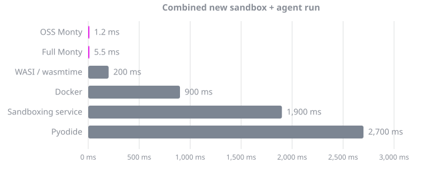

# Monty {.hide}

<p style="text-align: center; font-size: 1.15em">
  <em>A sandboxed Python interpreter, written in Rust, for code written by AI.</em>
</p>
<p style="text-align: center">
  <a href="https://github.com/pydantic/monty/actions/workflows/ci.yml?query=branch%3Amain"></a>
  <a href="https://codecov.io/gh/pydantic/monty"></a>
  <a href="https://pypi.python.org/pypi/pydantic-monty"></a>
  <a href="https://www.npmjs.com/package/@pydantic/monty"></a>
  <a href="https://github.com/pydantic/monty/blob/main/LICENSE"></a>
  <a href="https://logfire.pydantic.dev/docs/join-slack/"></a>
</p>

Monty runs Python written by a model with no container, VM or sandboxing service in the loop.
It parses with [Ruff](https://github.com/astral-sh/ruff)'s parser and executes on its own bytecode VM inside a worker
subprocess: creating a sandbox and running ten commands in it takes 5 ms, and each further command about 40 µs.
Filesystem, environment variables and network do not exist inside that VM.
The sandbox reaches the host only through the [functions](host-functions.md) and [mounts](filesystem.md) you pass to
each call.

## Latency



| Sandbox                      | Cold start | Agent run, warm† | Combined‡ |
| ---------------------------- | ---------- | ---------------- | --------- |
| Monty                        | 5 ms       | 0.4 ms           | 5 ms      |
| WASI / wasmtime              | 16 ms      | 180 ms           | 200 ms    |
| Docker                       | 195 ms     | 700 ms           | 900 ms    |
| Sandboxing service (Daytona) | 1500 ms    | 400 ms           | 1900 ms   |
| Pyodide in Deno              | 2700 ms    | 35 ms            | 2700 ms   |

† 10 commands run in a REPL against a sandbox that already exists, as you might expect from a simple agent with code
mode.
Monty keeps the session, so each command is one feed; the others have no persistent interpreter, so command *n* re-runs
commands 1 to *n*.

‡ The time to create the sandbox and perform the agent run: the two columns added together.

Learn more in the [comparison to alternatives](alternatives.md).

## Why Monty

1. **Latency in microseconds, not seconds.** A sandbox plus ten REPL commands takes 5 ms against 900 ms for Docker and
   1900 ms for a sandboxing service, because the sandbox is a subprocess, a command is one message each way, and the
   session persists so nothing is re-run.
   See [start latency](#latency).
2. **Suspend and resume from bytes.** Every host call suspends the interpreter; `feed_start` returns the suspension and
   `dump()` serialises the whole interpreter, paused call stack included, to bytes you can store and `load_snapshot`
   later on another machine.
   There are no file descriptors, sockets or threads inside the sandbox, so nothing has to be reconstructed.
   See [snapshots](snapshots.md).
3. **Limits that fire before the damage.** `max_memory`, `max_duration_secs`, `max_recursion_depth` and
   `max_suspensions` are enforced by the VM itself; `'x' * 10**12` raises `MemoryError` before the allocation is
   attempted.
   A worker that crashes anyway takes only itself down and the pool replaces it.
   See [resource limits](resource-limits.md).
4. **A package, not infrastructure.** `uv add pydantic-monty`, `npm install @pydantic/monty` or `cargo add monty-pool`:
   about 4.5 MB, no daemon, no image, no API key, and a worker baseline of about 2 MB so one machine runs hundreds.
   See [install](install/python.md).
5. **MIT licensed, with a commercial server when you need one.** The interpreter, the pool and every binding are open
   source.
   [`monty-server`](server.md) runs the same workers behind a WebSocket as a container image, adding per-caller quotas,
   tracing and horizontal scaling.

## Example

=== "Python"

    ```bash
    uv add pydantic-monty
    ```

=== "TypeScript"

    ```bash
    npm install @pydantic/monty
    ```

=== "Rust"

    ```bash
    cargo add monty
    ```

The `code` string is what a model writes when asked how long a bar of chocolate could power a lightbulb.
It calls a tool it was given, does arithmetic it should not do in its head, and prints the answer:

```python
from pydantic_monty import Monty

code = """
kcal = nutrition('chocolate bar')['kcal']
hours = kcal * 4184 / (bulb_watts * 3600)
print(f'a chocolate bar powers a {bulb_watts} W bulb for {hours:.1f} hours')
"""

with Monty() as pool:
    with pool.checkout() as session:
        session.feed_run(
            code,
            inputs={'bulb_watts': 10},
            external_lookup={'nutrition': lambda food: {'kcal': 230}},
        )
        #> a chocolate bar powers a 10 W bulb for 26.7 hours
```

`nutrition` ran on the host and the sandbox saw only its return value; the sandbox has no filesystem, environment or
network with which to reach anything else.
The [Python](quickstart/python.md), [JavaScript](quickstart/javascript.md) and [Rust](quickstart/rust.md) quickstarts
take it from here.

## Where the code comes from

LLMs are often faster, cheaper and more reliable when they write a short program that calls your tools, instead of
making a sequence of individual tool calls: [code mode](https://blog.cloudflare.com/code-mode/) from Cloudflare,
[programmatic tool calling](https://platform.claude.com/docs/en/agents-and-tools/tool-use/programmatic-tool-calling) and
[code execution with MCP](https://www.anthropic.com/engineering/code-execution-with-mcp) from Anthropic,
[smolagents](https://github.com/huggingface/smolagents) from Hugging Face.
All of them need somewhere safe to run the generated code, and Monty is that place.

## What Monty is not for

Code that needs the Python ecosystem: `import pandas`, a notebook, a user-supplied script.
The sandbox has no `sys.path`, no site-packages and a [subset of the standard library](python-subset.md); class
inheritance, generators and `match` are rejected at parse time.
For those workloads use a container or a sandboxing service, or the CPython option planned for
[`monty-server`](server.md); the [comparison to alternatives](alternatives.md) says which fits which case.

## Who uses it

Monty runs [Code Mode](https://pydantic.dev/docs/ai/harness/code-mode/) in Pydantic AI.
Community bindings exist for Go ([gomonty](https://github.com/ewhauser/gomonty/)) and Dart
([dart_monty](https://github.com/runyaga/dart_monty)).
[Hack Monty](https://pydantic.dev/monty) offers a $20,000 bounty for escaping the sandbox; round 3 is open.

## Next steps

- [Install](install/python.md) for Python, [JavaScript](install/javascript.md), [Rust](install/rust.md) or
  [Docker](install/docker.md).
- QuickStart for [Python](quickstart/python.md), [JavaScript](quickstart/javascript.md) or [Rust](quickstart/rust.md).
- [Security model](security.md) for what "secure" does and does not mean here.
- [Examples](examples.md), including Code Mode in Pydantic AI.

## Part of the Pydantic Stack

- [Pydantic AI](https://pydantic.dev/pydantic-ai) — type-safe agent framework
- [Pydantic Logfire](https://pydantic.dev/logfire) — AI-first, full-stack observability
- [Logfire AI Gateway](https://pydantic.dev/ai-gateway) — unified LLM proxy
