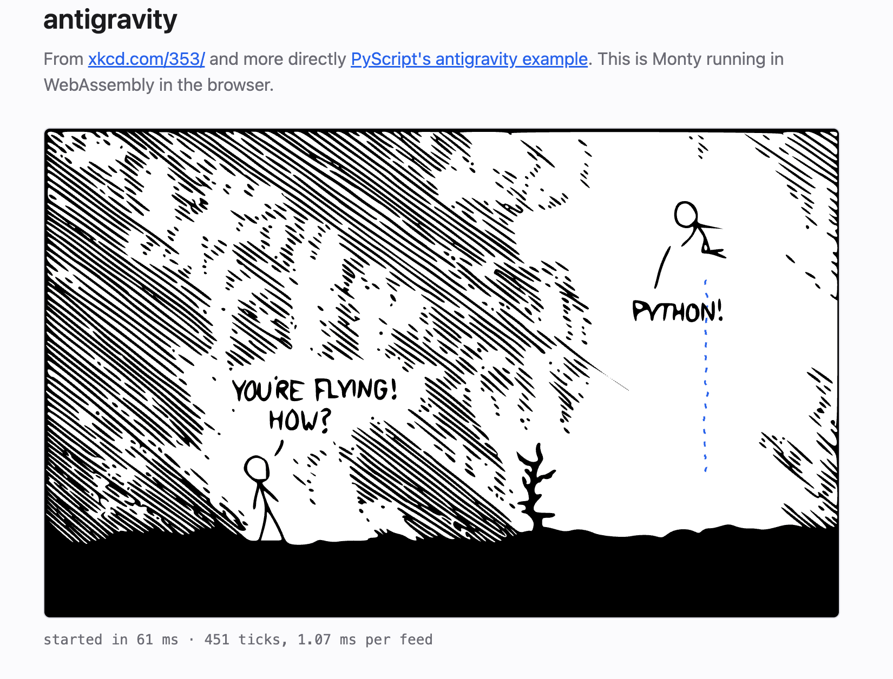

# antigravity in the browser

[xkcd 353](https://xkcd.com/353/), running the Python from the
[PyScript example](https://github.com/pyscript/examples/tree/main/antigravity) in a Monty sandbox in the browser.
Monty is compiled to WebAssembly and runs in a Web Worker; opening the page starts the flight.



## Running it

The wasm component is not checked in, so build it first from the repository root:

```bash
make build-wasm
cd examples/antigravity && npm install && npm run dev
```

`npm run build` writes a static bundle to `dist/`.

## How it works

[`antigravity.py`](antigravity.py) is the PyScript file with its five imports deleted; nothing else is changed.
The sandbox has no DOM, so [`main.ts`](main.ts) provides those five names instead:

- `random`, `DOMParser` and `pydom` are passed as `inputs`, as [host objects](../../docs/host-objects.md).
- `open_url` and `set_interval` are passed as `externalLookup`, as [host functions](../../docs/host-functions.md).

A host object is a JavaScript class instance wrapped in `ClassInstance`, and the sandbox can call its methods.
Each call suspends the sandbox, runs the method in the page, and resumes with the result.
`Node` wraps a DOM element and defines `getElementsByTagName`, `setAttribute` and `append`, so those are the only DOM
operations the program can perform, and `setAttribute` accepts `transform` only.

`main.ts` feeds the file once, which constructs `_auto`: the program calls `open_url` for the SVG, parses it with
`DOMParser`, and appends it to the page through `pydom`.
It then feeds `_auto.move()` every 10 ms.
The session keeps `_auto` between feeds, so each tick is one call.

Two things Monty does not do, and how the example works around them:

- A sandbox function cannot be passed to the host, so `set_interval(self.move, 10)` reaches `main.ts` as a marker and
    only the interval is used; `main.ts` runs the loop.
- The program does not `await open_url(...)`, so the host function cannot be async.
    `main.ts` fetches the SVG before starting the sandbox and returns it from memory.

Each host call counts against `maxSuspensions`, so the example raises it from the default of 1000; the flight ends when
the budget runs out.
The line under the comic shows the time from `Monty.create()` to a checked-out session, and the mean time per
`_auto.move()` feed.

The line art in [`antigravity.svg`](antigravity.svg) is copied from the PyScript example; the dashed trail is added by
`main.ts`.
xkcd is CC BY-NC 2.5, Randall Munroe.
