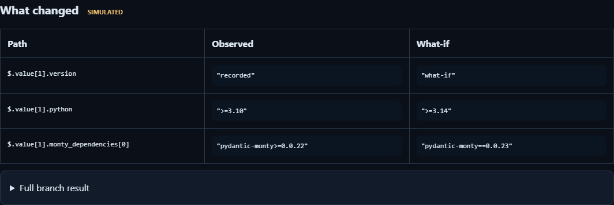

# Snapshot replay

Record synchronous host calls, restore a saved suspension in a fresh Monty worker, and compare a changed response.
The included program reads public PyPI metadata for three packages and returns their Monty dependencies.
Replay uses the recorded responses; it never calls PyPI.
No model or API key is required.

For example, replace the `pydantic-ai-harness` response with [response.json](response.json) to inspect a hypothetical
change to its Python requirement and Monty dependency:



The screenshot uses test inputs, not current PyPI metadata.
The other two package rows stay unchanged, and no package is fetched again.
The program reports dependency strings containing `monty`; it does not resolve dependencies or check compatibility.

Response branches keep all later recorded responses fixed.
If the replacement changes a later call or leaves recorded calls unused, replay stops with `DIVERGED`.
Matching calls do not establish how a live external system would respond to the changed execution.

## Run

From the repository root, build the current worker and Python client with `make dev-py`.
Pass the trusted worker explicitly; use `target/debug/monty.exe` instead on Windows.

Only load recordings you created and kept private.
A recording contains source, arguments, responses, printed output and opaque worker snapshots.
The checksums detect corruption, not malicious replacement.
Files remain on disk until you delete them; this example provides no automatic deletion, redaction or encryption.

In PowerShell, replace `install -d` below with `New-Item -ItemType Directory examples/snapshot_replay/recordings`.
On Windows, files inherit the directory's ACL; use a directory accessible only to your account.

```bash
install -d -m 700 examples/snapshot_replay/recordings
uv run python -m examples.snapshot_replay.main --binary target/debug/monty capture examples/snapshot_replay/recordings/run.jsonl
uv run python -m examples.snapshot_replay.main --binary target/debug/monty replay examples/snapshot_replay/recordings/run.jsonl
uv run python -m examples.snapshot_replay.main --binary target/debug/monty branch examples/snapshot_replay/recordings/run.jsonl --at 1 --response examples/snapshot_replay/response.json --output examples/snapshot_replay/recordings/branch.json
uv run python -m examples.snapshot_replay.main --binary target/debug/monty report examples/snapshot_replay/recordings/run.jsonl --branch examples/snapshot_replay/recordings/branch.json --output examples/snapshot_replay/recordings/report.html
```

Replay prints `same_result: true` when its output and return value match the recording.
`--at 1` selects the second call, for `pydantic-ai-harness`; indices start at zero.
Open `report.html` locally to inspect the calls and result differences.
Outputs use exclusive creation: choose new filenames for another capture or comparison.

To compare edited sandbox code, pass `--code path/to/edited.py` to `replay`.
That starts from the edited source rather than restoring bytecode from the original snapshot.

## Snapshot flow

[`capture()` in rewind.py](rewind.py) calls `session.feed_start()` and saves `snapshot.dump()` at each host call,
before running the callback.
It records the response and passes it to `snapshot.resume()` to continue execution.
For a response branch, `replay()` restores the selected suspension with `session.load_snapshot()` in a fresh worker.
It then calls `resume()` with the replacement response and the remaining recorded responses.
It has no live dispatcher.
See [storing and restoring snapshots](../../docs/snapshots.md#storing-and-restoring) for the underlying API.

## Boundaries

`rewind.py` owns the journal and replay logic.
`pypi_tools.py` owns the live HTTP callback and permits only the three named packages at a fixed PyPI endpoint.
The callback runs on the host with host authority, as described in [Monty's security model](../../docs/security.md).
Changing it requires validating the sandbox's arguments and bounding host work independently of Monty's limits.
Each PyPI fetch runs in a short-lived Python child with a 10-second deadline covering DNS, headers and body reads.
On timeout the child is killed and joined; capture stops without retrying the request.
The child accepts only an allowlisted package name and reads at most 1 MiB plus one overflow byte.

Each call and snapshot is flushed before the host callback runs.
Loading rejects empty or truncated recordings and reports a missing response or completion record.
A missing response does not establish whether the callback ran.
Do not retry a side-effecting callback merely because its response is missing.

This example accepts finite JSON values at the host boundary, up to 16 direct synchronous host calls, 32 KiB of source,
256 KiB per value or captured output, 512 KiB per snapshot and 8 MiB per recording.
It rejects host objects, OS calls, name-lookup suspensions and futures.
It does not inspect frames or locals, schedule async completions or persist host state.

### Replay

Replay requires the same Python client version and exact worker binary as capture.
It is not a cross-version snapshot format.
Restoring a later suspension preserves the recorded output prefix and remaining call count.
The snapshot carries its resource limits and accumulated execution time; restoring does not reset the time budget.
Memory limits apply to live allocations in the restored worker.
Two different error observations are reported as different, even if both mention a resource limit.

Capture and edited-source replay reject syntax errors with `ReplayError`, preserving Monty's diagnostic.
A rejected capture has no completion record; a rejected replay produces no comparison.
Type checking is not enabled.
For both edited source and response branches, the name, host-visible JSON arguments, mapping order and order of
every remaining host call must match the recording.
A mismatch reports `DIVERGED`; it does not fetch another response.
Returning early is allowed only after all remaining recorded calls have been consumed.
Monty converts some guest values, such as functions, to strings before the host receives them.
Replay cannot distinguish those values from literal strings with the same text; see
[host-function argument conversion](../../docs/host-functions.md#arguments-and-return-values).

### Files and reports

On POSIX, new artifacts are created with mode `0600`, independent of a permissive umask.
The comparison file includes the replacement response or edited source as well as the original recording's checksum.
Comparison files use compact JSON and the same 8 MiB limit for writing and reading.
The HTML report contains no scripts or remote assets.

Printed output is an ordered list of `[stream, text]` pairs, with `stdout` and `stderr` kept distinct.
Adjacent fragments from the same stream are combined, so transport chunk boundaries do not affect comparisons.
Saved prefixes retain stream order when replay restores a later suspension.
The output cap charges UTF-8 text bytes plus 64 bytes per retained pair, including the restored prefix.
This is a logical buffer limit, not a host-memory measurement.
Recordings use schema 3; older recordings lack stream labels and must be captured again.

Reports are limited to 8 MiB of UTF-8 HTML, including escaping.
Comparison traversal stops at 10,000 nodes, 200 differences or a path longer than 1,024 characters.
Exceeding these limits raises an error before a report file is created; differences are not silently truncated.

## Tests

The regression suite uses real workers with deterministic host responses and does not call PyPI.

```bash
uv run --package pydantic-monty-client --only-dev python -m pytest crates/monty-python/tests/test_snapshot_replay_example.py
uv run ruff check examples/snapshot_replay/main.py examples/snapshot_replay/rewind.py examples/snapshot_replay/pypi_tools.py crates/monty-python/tests/test_snapshot_replay_example.py
uv run ruff format --check examples/snapshot_replay/main.py examples/snapshot_replay/rewind.py examples/snapshot_replay/pypi_tools.py crates/monty-python/tests/test_snapshot_replay_example.py
```
